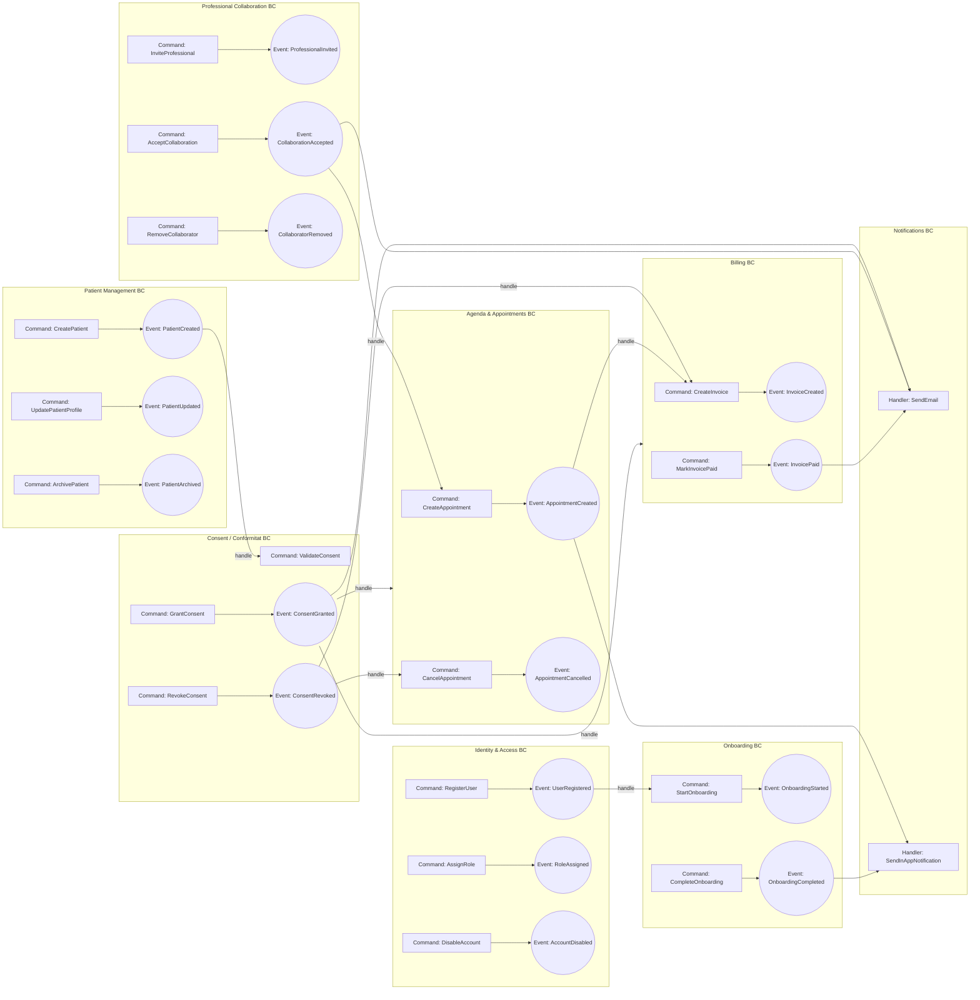

# Bounded Context interactions

```mermaid
graph LR

%% =========================
%% IDENTITY & ACTORS
%% =========================
  subgraph IAM["Identity & Access BC"]
    I1["Command: RegisterUser"]
    I2["Command: AssignRole"]
    I3["Command: DisableAccount"]

    IE1(("Event: UserRegistered"))
    IE2(("Event: RoleAssigned"))
    IE3(("Event: AccountDisabled"))

    I1 --> IE1
    I2 --> IE2
    I3 --> IE3
  end

  subgraph PATIENT["Patient Management BC"]
    P1["Command: CreatePatient"]
    P2["Command: UpdatePatientProfile"]
    P3["Command: ArchivePatient"]

    PE4(("Event: PatientCreated"))
    PE5(("Event: PatientUpdated"))
    PE6(("Event: PatientArchived"))

    P1 --> PE4
    P2 --> PE5
    P3 --> PE6
  end

%% =========================
%% CORE DOMAIN
%% =========================
  subgraph CONSENT["Consent / Conformitat BC"]
    C1["Command: GrantConsent"]
    C2["Command: RevokeConsent"]
    C3["Command: ValidateConsent"]

    E1(("Event: ConsentGranted"))
    E2(("Event: ConsentRevoked"))

    C1 --> E1
    C2 --> E2
  end

  subgraph COLLAB["Professional Collaboration BC"]
    PC1["Command: InviteProfessional"]
    PC2["Command: AcceptCollaboration"]
    PC3["Command: RemoveCollaborator"]

    PE1(("Event: ProfessionalInvited"))
    PE2(("Event: CollaborationAccepted"))
    PE3(("Event: CollaboratorRemoved"))

    PC1 --> PE1
    PC2 --> PE2
    PC3 --> PE3
  end

%% =========================
%% OPERATIONS
%% =========================
  subgraph AGENDA["Agenda & Appointments BC"]
    A1["Command: CreateAppointment"]
    A2["Command: CancelAppointment"]

    AE1(("Event: AppointmentCreated"))
    AE2(("Event: AppointmentCancelled"))

    A1 --> AE1
    A2 --> AE2
  end

  subgraph BILLING["Billing BC"]
    B1["Command: CreateInvoice"]
    B2["Command: MarkInvoicePaid"]

    BE1(("Event: InvoiceCreated"))
    BE2(("Event: InvoicePaid"))

    B1 --> BE1
    B2 --> BE2
  end

%% =========================
%% EXPERIENCE / SUPPORTING
%% =========================
  subgraph ONBOARD["Onboarding BC"]
    O1["Command: StartOnboarding"]
    O2["Command: CompleteOnboarding"]

    OE1(("Event: OnboardingStarted"))
    OE2(("Event: OnboardingCompleted"))

    O1 --> OE1
    O2 --> OE2
  end

  subgraph NOTIF["Notifications BC"]
    N1["Handler: SendEmail"]
    N2["Handler: SendInAppNotification"]
  end

%% =========================
%% INTER-BC HANDLERS
%% =========================

%% Consent affects Agenda & Billing
E1 -->|"handle"| AGENDA
E1 -->|"handle"| BILLING

%% Consent revoked blocks operations
E2 -->|"handle"| A2
E2 -->|"handle"| B1

%% Collaboration enables agenda visibility
PE2 -->|"handle"| A1

%% Identity triggers onboarding
IE1 -->|"handle"| O1

%% Patient creation triggers consent flow
PE4 -->|"handle"| C3

%% Appointment triggers billing
AE1 -->|"handle"| B1

%% Events triggering notifications
E1 --> N1
PE2 --> N1
AE1 --> N2
BE2 --> N1
OE2 --> N2
```